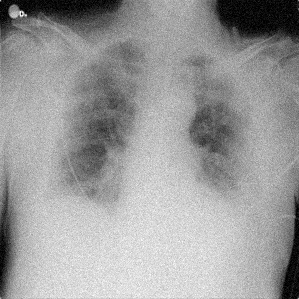
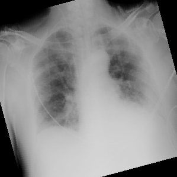
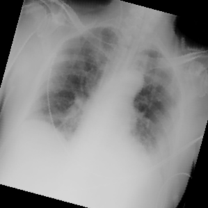
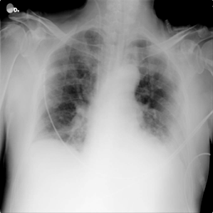

# Investigating the Impact of Using Image Processing Techniques in Chest X-Ray images for COVID-19 Diagnosis via Deep Learning

## Authors

- [Breno Maurício de Freitas Viana](https://github.com/brenov) (11920060)
- [Felipe Antunes Quirino](https://github.com/felipeaq) (12448645)

## Introduction

Since World Health Organization (WHO) recognized COVID-19 as a global threat, several works of different areas about the topic emerged.
Regarding abnormalities detection, numerous works try to classify COVID-19 cases from Chest X-Ray images and images of other lung image acquisition methods.
Most of these works applied Deep Learning (DL) techniques for predicting COVID-19 and non-COVID-19 cases in the original lung images.

## Objective

This work intends to investigate the impact of using image preprocessing techniques on the chest X-ray images in their classification in COVID-19 and non-COVID-19 cases.
We believe that such a process may improve the COVID-19 diagnosis performed by the ResNet-50 with the original chest X-ray images.
The ResNet-50 version of the ResNet model contains 48 Convolution layers, 1 MaxPool, and 1 Average Pool layer.

## Dataset

In this investigation, we are using the COVID-19 Chest X-ray Database from [Kaggle](https://www.kaggle.com/tawsifurrahman/covid19-radiography-database)
(the dataset present in this repository ([Dataset](Dataset)) present 40 images, and it is just a small subset of the COVID-19 Chest X-ray Database).
Furthermore, it was originally provided by Chowdhury et al. [1] and Rahman et al. [2].
This dataset contains chest X-ray images of healthy people (10,192) and people diagnosed with COVID-19, viral pneumonia (1,345), and lung opacity, i.e., non-COVID-19 lung infection (6,012).
All the images are gray-scale in PNG file format, and their resolution is 299x299 pixels.
The following images present examples of such cases:

<table>
  <tr>
    <td>
      
    </td>
    <td>
      
    </td>
   </tr>
   <tr>
      <td>Normal</td>
      <td>Lung Opacity</td>
   </tr>
   <tr>
    <td>
      
    </td>
    <td>
      
    </td>
   </tr>
   <tr>
      <td>Viral Pneumonia</td>
      <td>COVID-19</td>
  </tr>
</table>

Since we this is a preliminary stage of our research, we selected the first 1.000 images of each class from the database to perform our experiments.

## Methodology

To carry out our investigation, we first perform data augmentation by using the following image processing techniques: noise insertion, rotation, contrast adjustment, and sharpness adjustment.
Before the augmentation, we verify if they are represented in a single grayscale channel or RBG images.
In the latter case, we perform the luminance method to convert the images into a single grayscale channel.
These image processing methods are implemented in the [augmentation.py](augmentation.py) file.
The data augmentation is performed by the script [augmentate.py](augmentate.py).
This script automatizes the data augmentation process by reading all the images from [Dataset](Dataset) and creating eight new versions of each original image, two for each processing image technique.
We rotate the images in 15 degrees and -15 degrees; we opt for these values to simulate and (maybe) fix some badly positioned chest X-rays.
We generated images with two intensities of noise (both means and standard deviations equal to 5 and 10), contrast adjustment (factor equal to 1.1 and 1.2), and sharpness adjustment (factors equal to 0.1 and 0.3, sigma values equal to 1.5 and 3, and k values equal to 7.5 and 11) for the remaining techniques.

- **Noise Insertion**: consists basically in inserting random pixels in the input image.
- **Contrast Adjustment**: comprises the following equation `128 + C * F - C * 128`, where `F` is the input image, `C` is the contrast level, and the value `128` is the mid-value the [0-255] range.
- **Sharpeness Adjustment**: consists in applying the equation `F + C * (F - G)`, where, `F` is the input image, `G` is the blurred version of the input image `F`, and `C` is the adjustment level.
- **Rotation**: We apply the [rotation equation](https://www.sciencedirect.com/topics/computer-science/image-rotation) to rotate the input image.
When we rotate `θ` angles the point `(x1, y1)` arround the point `(x0, y0)` (in our case, the image center) we get the new point `(x2, y2)`.
  - `x2 = cos(θ) * (x1 − x0) + sin(θ) * (y1 − y0)` calculates the new `x` position of each pixel.
  - `y2 = −sin(θ) * (x1 − x0) + cos(θ) * (y1 − y0)` calculates the new `y` position of each pixel.

After the data augmentation, we used both the original images (from [Dataset](Dataset)) and the images generated by the data augmentation techniques (from [Augmented](Augmented)) for training the ResNet-50.
The CNN model and its training results are present in [Jupyter Notebook file](resnet-50-2.ipynb).
In the next step of this wotk, we will perform the fine-tuning of the ResNet-50 model.

## Partial Results

The partial results are present in [Jupyter Notebook file](resnet-50-2.ipynb) in the folder [Augmented](Augmented).
First, at this point of the project does not make much sense present results in terms of, for instance, accuracy since we trained the model with a small number of images.
Therefore, in the last cell of [Jupyter Notebook file](resnet-50-2.ipynb), we present the result of the ResNet-50 training with images from both [Dataset](Dataset) and [Augmented](Augmented) folders.
Second, the folder [Augmented](Augmented) presents the augmented images generated from the [Dataset](Dataset).
So far, we geneated a total of 200 images.
The following images present some results of the data augmentation process.

<table>
  <tr>
    <td>
      
    </td>
    <td>
      
    </td>
    <td>
      
    </td>
  </tr>
  <tr>
    <td><b>Input image</b></td>
    <td>Noisy image</td>
    <td>15-degree rotated image</td>
  </tr>
  <tr>
    <td>
      
    </td>
    <td>
      
    </td>
    <td>
      
    </td>
  </tr>
  <tr>
    <td>-15-degree rotated image</td>
    <td>Image with contrast adjusted</td>
    <td>Image with sharpeness adjusted</td>
  </tr>
</table>

## References

[1] M.E.H. Chowdhury, T. Rahman, A. Khandakar, R. Mazhar, M.A. Kadir, Z.B. Mahbub, K.R. Islam, M.S. Khan, A. Iqbal, N. Al-Emadi, M.B.I. Reaz, M. T. Islam, “Can AI help in screening Viral and COVID-19 pneumonia?” IEEE Access, Vol. 8, 2020, pp. 132665 - 132676. Paper DOI: (https://doi.org/10.1109/ACCESS.2020.3010287).

[2] Rahman, T., Khandakar, A., Qiblawey, Y., Tahir, A., Kiranyaz, S., Kashem, S.B.A., Islam, M.T., Maadeed, S.A., Zughaier, S.M., Khan, M.S. and Chowdhury, M.E., 2020. Exploring the Effect of Image Enhancement Techniques on COVID-19 Detection using Chest X-ray Images. Paper DOI: (https://doi.org/10.1016/j.compbiomed.2021.104319).
