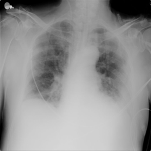

# Investigating the Impact of Using Image Processing Techniques in Chest X-Ray images for COVID-19 Diagnosis via Deep Learning

## Abstract

Since World Health Organization (WHO) recognized COVID-19 as a global threat, several papers of different areas about the topic emerged.
Regarding abnormalities detection, numerous works try to classify COVID-19 cases from Chest X-Ray images and images of other lung image acquisition methods.
Most of these works applied Deep Learning (DL) techniques for predicting COVID-19 cases in the original images.
This work intends to investigate the impact of using image preprocessing techniques on the chest X-ray images in their classification in COVID-19 and non-COVID-19 cases.
We believe that such a process may improve the COVID-19 diagnosis performed by the ResNet-50.
To do so, we will perform data augmentation by using the following image processing techniques: rotation, contrast adjustment, sharpness enhancement, and noise insertion.
After data this stage, we will perform the fine-tuning of the neural network aiming to improve the results.

## Dataset

COVID-19 Chest X-ray Database (https://www.kaggle.com/tawsifurrahman/covid19-radiography-database). The dataset present in this repository is just a small subset of the COVID-19 Chest X-ray Database.

### Example of input images

<table >
  <tr>
    <td>
      
    </td>
    <td>
      
    </td>
    <td>
      
    </td>
    <td>
      
    </td>
   </tr>
   <tr>
      <td>Normal</td>
      <td>Lung Opacity</td>
      <td>Viral Pneumonia</td>
      <td>COVID</td>
  </tr>
</table>

## Authors

- Breno Maurício de Freitas Viana
- Felipe Antunes Quirino
